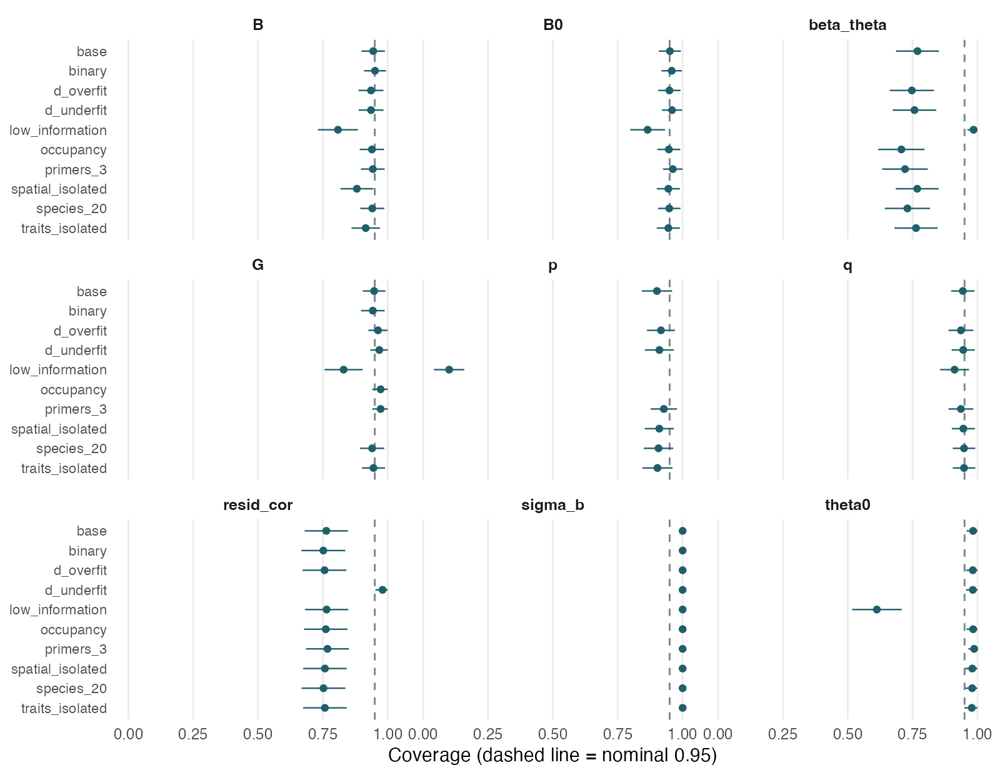
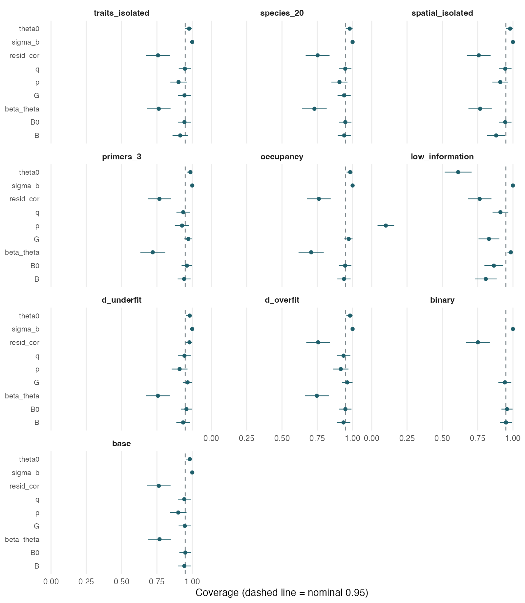

```{=html}
<div class="occjsdm-report">
<style>
.occjsdm-report {
  --ground:      #F5F6F4;
  --ground-sunk: #ECEEEA;
  --rule:        #D3D8D2;
  --ink:         #15202B;
  --ink-soft:    #4E5B62;
  --ink-faint:   #7C878C;
  --accent:      #1F5F6B;
  --good:        #3E7D5A;
  --warn:        #A06A1B;
  --bad:         #9E3A2E;
  --good-fill:   #C5D8C9;
  --bad-fill:    #E3C0B8;

  --serif: "Iowan Old Style", "Palatino Linotype", Palatino, Georgia, serif;
  --sans:  system-ui, -apple-system, "Segoe UI", Helvetica, Arial, sans-serif;
  --mono:  ui-monospace, SFMono-Regular, "SF Mono", Menlo, Consolas, monospace;

  background: var(--ground);
  color: var(--ink);
  font-family: var(--sans);
  font-size: 17px;
  line-height: 1.65;
  -webkit-font-smoothing: antialiased;
  border-radius: 8px;
}

/* Synced to pkgdown's own light/dark toggle (data-bs-theme on <html>)
   rather than the OS preference, so this block always matches the rest
   of the page regardless of which one the reader has set. */
html[data-bs-theme="dark"] .occjsdm-report {
  --ground:      #12181C;
  --ground-sunk: #1A2126;
  --rule:        #2C3740;
  --ink:         #E4E9E7;
  --ink-soft:    #A6B2B6;
  --ink-faint:   #77848A;
  --accent:      #6BB3BF;
  --good:        #74B48C;
  --warn:        #D3A245;
  --bad:         #DC8371;
  --good-fill:   #2E4638;
  --bad-fill:    #4E2E29;
}

.occjsdm-report .wrap {
  /* Widened from 45rem: the per-species and coverage tables (5-7 columns)
     were readable but tight at 45rem, needing the .scroller fallback more
     than the prose needed. Paragraphs keep their own 40rem cap below, so
     text width is unaffected; only the tables get the extra room. */
  max-width: 58rem;
  margin: 0 auto;
  padding: 3rem 1.5rem 4rem;
  display: flex;
  flex-direction: column;
  gap: 3.25rem;
}

.occjsdm-report .eyebrow {
  font-family: var(--mono);
  font-size: 0.7rem;
  letter-spacing: 0.14em;
  text-transform: uppercase;
  color: var(--accent);
}

.occjsdm-report h1 {
  font-family: var(--serif);
  font-size: clamp(2.1rem, 5.5vw, 3rem);
  line-height: 1.1;
  font-weight: 600;
  letter-spacing: -0.015em;
  text-wrap: balance;
  margin: 0.5rem 0 0;
}

.occjsdm-report .standfirst {
  font-family: var(--serif);
  font-size: 1.2rem;
  line-height: 1.55;
  color: var(--ink-soft);
  margin: 1rem 0 0;
  max-width: 34rem;
}

.occjsdm-report h2 {
  font-family: var(--serif);
  font-size: 1.6rem;
  font-weight: 600;
  line-height: 1.2;
  letter-spacing: -0.01em;
  text-wrap: balance;
  margin: 0;
  padding-top: 1.5rem;
  border-top: 1px solid var(--rule);
}

.occjsdm-report h3 {
  font-size: 0.95rem;
  font-weight: 650;
  margin: 0;
  letter-spacing: 0.005em;
}

.occjsdm-report section { display: flex; flex-direction: column; gap: 1.1rem; }
.occjsdm-report p { margin: 0; max-width: 40rem; }
.occjsdm-report strong { font-weight: 650; }
.occjsdm-report code {
  font-family: var(--mono);
  font-size: 0.86em;
  background: var(--ground-sunk);
  padding: 0.1em 0.34em;
  border-radius: 2px;
}

/* ---- the tally: coverage made visible ---- */
.occjsdm-report .tally-set { display: flex; flex-direction: column; gap: 2rem; }
.occjsdm-report .tally { display: flex; flex-direction: column; gap: 0.75rem; }

.occjsdm-report .tally-head {
  display: flex;
  align-items: baseline;
  justify-content: space-between;
  gap: 1rem;
  flex-wrap: wrap;
}

.occjsdm-report .tally-label { font-size: 0.92rem; color: var(--ink-soft); }
.occjsdm-report .tally-label b { color: var(--ink); font-weight: 650; }

.occjsdm-report .tally-delta {
  font-family: var(--mono);
  font-variant-numeric: tabular-nums;
  font-size: 0.78rem;
  color: var(--ink-faint);
  letter-spacing: 0.02em;
}

.occjsdm-report .tally-row {
  display: grid;
  /* First column is sized for a short caption. Do not put long parameter names
     here: beta_theta needs 73px against this column's 58, and widening it
     pushed the whole row past 375px on a phone. Parameter names go in the
     .tally-label, which wraps. */
  grid-template-columns: 3.6rem 1fr 3.2rem;
  gap: 0 0.9rem;
  align-items: center;
}

.occjsdm-report .tally-when {
  font-family: var(--mono);
  font-size: 0.66rem;
  text-transform: uppercase;
  letter-spacing: 0.09em;
  color: var(--ink-faint);
}

.occjsdm-report .tally-score {
  font-family: var(--mono);
  font-variant-numeric: tabular-nums;
  font-size: 0.95rem;
  font-weight: 600;
  text-align: right;
}
.occjsdm-report .tally-score.is-good { color: var(--good); }
.occjsdm-report .tally-score.is-warn { color: var(--warn); }
.occjsdm-report .tally-score.is-bad  { color: var(--bad); }

.occjsdm-report .marks {
  display: grid;
  grid-template-columns: repeat(25, 1fr);
  gap: 3px;
}
@media (max-width: 34rem) { .occjsdm-report .marks { grid-template-columns: repeat(20, 1fr); } }

.occjsdm-report .marks.is-before { opacity: 0.42; }
.occjsdm-report .mark { aspect-ratio: 1; border-radius: 1px; }
.occjsdm-report .mark.hit  { background: var(--good-fill); }
.occjsdm-report .mark.miss { background: var(--bad); }

.occjsdm-report .tally-note { font-size: 0.85rem; color: var(--ink-faint); margin: 0; }

/* ---- tiers ---- */
.occjsdm-report .tiers { display: flex; flex-direction: column; gap: 0; }

.occjsdm-report .tier {
  display: grid;
  grid-template-columns: 4.5rem 1fr;
  gap: 0 1.25rem;
  padding: 1.15rem 0;
  border-bottom: 1px solid var(--rule);
  align-items: start;
}
.occjsdm-report .tier:first-child { border-top: 1px solid var(--rule); }

.occjsdm-report .tier-when {
  font-family: var(--mono);
  font-size: 0.72rem;
  line-height: 1.5;
  color: var(--accent);
  letter-spacing: 0.03em;
  padding-top: 0.15rem;
}
.occjsdm-report .tier-body { display: flex; flex-direction: column; gap: 0.35rem; }
.occjsdm-report .tier-body p { font-size: 0.92rem; color: var(--ink-soft); }

/* ---- tables ---- */
.occjsdm-report .scroller { overflow-x: auto; }
.occjsdm-report table { border-collapse: collapse; width: 100%; font-size: 0.9rem; }
.occjsdm-report caption {
  text-align: left;
  font-size: 0.85rem;
  color: var(--ink-faint);
  padding-bottom: 0.6rem;
}
.occjsdm-report th, .occjsdm-report td {
  text-align: left;
  padding: 0.55rem 0.9rem 0.55rem 0;
  border-bottom: 1px solid var(--rule);
  vertical-align: top;
}
.occjsdm-report th {
  font-size: 0.72rem;
  text-transform: uppercase;
  letter-spacing: 0.08em;
  color: var(--ink-faint);
  font-weight: 600;
  border-bottom-color: var(--ink-faint);
}
.occjsdm-report td.name { font-family: var(--mono); font-size: 0.82rem; white-space: nowrap; }
.occjsdm-report td.num  { font-family: var(--mono); font-variant-numeric: tabular-nums; }

.occjsdm-report tr.flag td { background: var(--ground-sunk); }
.occjsdm-report td.num.lo { color: var(--bad);  font-weight: 650; }
.occjsdm-report td.num.hi { color: var(--accent); font-weight: 650; }

/* ---- callouts ---- */
.occjsdm-report .pending {
  border-left: 3px solid var(--accent);
  padding: 0.9rem 0 0.9rem 1.1rem;
  display: flex;
  flex-direction: column;
  gap: 0.5rem;
}
.occjsdm-report .pending p { font-size: 0.92rem; color: var(--ink-soft); }

.occjsdm-report .finding {
  border-left: 3px solid var(--warn);
  padding: 0.9rem 0 0.9rem 1.1rem;
  display: flex;
  flex-direction: column;
  gap: 0.5rem;
}
.occjsdm-report .finding p { font-size: 0.92rem; color: var(--ink-soft); }
.occjsdm-report .finding h3 { color: var(--ink); }

.occjsdm-report .fig {
  display: flex;
  flex-direction: column;
  gap: 0.6rem;
}
.occjsdm-report .fig img {
  width: 100%;
  height: auto;
  border-radius: 6px;
  border: 1px solid var(--rule);
  /* the PNGs are rendered on a fixed white background; a light card behind
     them keeps that from looking like a mistake against a dark page */
  background: #fff;
  padding: 0.5rem;
}
.occjsdm-report .fig figcaption {
  font-size: 0.85rem;
  color: var(--ink-faint);
  max-width: 40rem;
}

.occjsdm-report footer {
  border-top: 1px solid var(--rule);
  padding-top: 1.25rem;
  font-size: 0.82rem;
  color: var(--ink-faint);
}
</style>

<div class="wrap">

  <header>
    <div class="eyebrow">occJSDM &middot; validation &middot; 2 August 2026</div>
    <h1>Checking occJSDM against simulated truth</h1>
    <p class="standfirst">
      Two questions, asked of the same model: how close its estimates are to the truth,
      and how honest the uncertainty around them is. Neither answer implies the other,
      and this package is currently better at one than the other.
    </p>
  </header>

  <section>
    <h2>The trick behind every test</h2>
    <p>
      All of it rests on one idea: <strong>make fake data where we already know the
      right answer.</strong> <code>simulateOccJSDMData()</code> lets us choose the true
      species coefficients, the true detection rates, the true everything &mdash; then
      generate a dataset from them.
    </p>
    <p>
      We hand that dataset to <code>runOccJSDM()</code>, which knows none of it, and
      check whether it finds its way back. Real data can never do this. You never know
      the true occupancy of a species at a site, so you can never tell whether the model
      got it right.
    </p>
    <p>
      Everything below is one of two questions. <strong>Is the estimate close?</strong>
      That is accuracy, and it comes first. <strong>Is the stated uncertainty
      honest?</strong> That is calibration, and it comes second. A model can pass either
      while failing the other, and this one does exactly that in places.
    </p>
  </section>

  <section>
    <h2>Recovering occupancy, species by species</h2>
    <p>
      Start with the thing an occupancy model exists to do: say where each species is.
      One fit of a hundred sites and ten species, two chains of 500 iterations after 500
      discarded. Source: <code>tests/testthat/test-recovery-occupancy.R</code>.
    </p>
    <div class="scroller">
      <table>
        <caption>
          One row per species from a single fit. Shaded rows fall below a threshold used
          by one of the checks in the next table.
        </caption>
        <thead>
          <tr>
            <th>species</th><th>occ_true</th><th>occ_est</th><th>psi_cor</th>
            <th>auc</th><th>drv_cov</th><th>drv_err</th>
          </tr>
        </thead>
        <tbody>
          <tr><td class="num">1</td><td class="num">0.44</td><td class="num">0.516</td><td class="num">0.782</td><td class="num">0.805</td><td class="num">1.000</td><td class="num">0.321</td></tr>
          <tr class="flag"><td class="num">2</td><td class="num">0.48</td><td class="num">0.412</td><td class="num lo">0.271</td><td class="num">0.700</td><td class="num">1.000</td><td class="num">0.451</td></tr>
          <tr><td class="num">3</td><td class="num">0.53</td><td class="num">0.423</td><td class="num">0.790</td><td class="num">0.872</td><td class="num">1.000</td><td class="num">0.703</td></tr>
          <tr><td class="num">4</td><td class="num">0.50</td><td class="num">0.414</td><td class="num">0.793</td><td class="num">0.742</td><td class="num">1.000</td><td class="num">0.258</td></tr>
          <tr><td class="num">5</td><td class="num">0.53</td><td class="num">0.494</td><td class="num">0.727</td><td class="num">0.801</td><td class="num">1.000</td><td class="num">0.393</td></tr>
          <tr class="flag"><td class="num">6</td><td class="num">0.27</td><td class="num">0.479</td><td class="num lo">0.179</td><td class="num lo">0.572</td><td class="num">1.000</td><td class="num">1.046</td></tr>
          <tr><td class="num">7</td><td class="num">0.48</td><td class="num">0.449</td><td class="num">0.511</td><td class="num">0.687</td><td class="num">1.000</td><td class="num">0.697</td></tr>
          <tr><td class="num">8</td><td class="num">0.30</td><td class="num">0.577</td><td class="num">0.682</td><td class="num">0.799</td><td class="num">0.667</td><td class="num">1.456</td></tr>
          <tr><td class="num">9</td><td class="num">0.27</td><td class="num">0.336</td><td class="num">0.847</td><td class="num">0.921</td><td class="num">1.000</td><td class="num">0.777</td></tr>
          <tr><td class="num">10</td><td class="num">0.52</td><td class="num">0.373</td><td class="num">0.751</td><td class="num">0.864</td><td class="num">1.000</td><td class="num">0.720</td></tr>
        </tbody>
      </table>
    </div>
    <p>
      <b>occ_true</b> is the fraction of the hundred sites where the species really is
      present; <b>occ_est</b> is the fraction where the model thinks it is. Close values
      are necessary but not sufficient: a model can get the overall prevalence right
      while placing the species at entirely the wrong sites.
    </p>
    <p>
      <b>psi_cor</b> catches that. It correlates the estimated chance of presence against
      the true chance across sites, so it asks whether the species is put in the
      <em>right places</em> rather than merely the right number of them. It runs from
      &minus;1 to 1, and 0 means the estimates say nothing about where the species is.
      <b>auc</b> asks the same question more forgivingly: the chance the model rates a
      site where the species really is present above one where it really is absent. A
      coin flip scores 0.5.
    </p>
    <p>
      The last two columns concern the coefficients underneath. Each species has three
      &mdash; a baseline and two environmental effects. <b>drv_cov</b> is the share whose
      stated range contains the true value, and <b>drv_err</b> is the average distance
      from best guess to truth, on the coefficients&rsquo; own scale, so there is no fixed
      good value.
    </p>
    <p>
      <strong>Species 6 is the row to read twice.</strong> Its <code>psi_cor</code> of
      0.179 and <code>auc</code> of 0.572 say the model has barely located it, and its
      <code>drv_err</code> is the second worst here &mdash; yet <code>drv_cov</code> is a
      perfect 1.000, because the intervals are wide enough to contain the truth anyway.
      Honest uncertainty about a poor estimate. That pairing is the reason this article
      asks two questions rather than one, and it recurs at grid scale further down.
    </p>
    <p>
      Species with a low <code>occ_true</code> are the hard ones. Species 6 and 9 are both
      present at 27% of sites, and 9 is recovered well while 6 is not. A single fit cannot
      say whether that is a property of the model or the luck of one dataset.
    </p>

    <h3>The checks these numbers have to pass</h3>
    <p>
      The table above is one snapshot. The test asserts on pooled summaries of it, with
      floors set by running the whole thing under eight different sets of random seeds and
      taking a value comfortably below the worst seen, so a failure means breakage rather
      than an unlucky draw.
    </p>
    <div class="scroller">
      <table>
        <caption>Asserted quantities. All five pass on this run.</caption>
        <thead>
          <tr><th>What it measures</th><th>Result</th><th>Floor</th><th>Swept</th></tr>
        </thead>
        <tbody>
          <tr>
            <td>Estimated occupancy tracking the truth, averaged over species</td>
            <td class="num">0.633</td><td class="num">0.30</td><td class="num">0.498&ndash;0.753</td>
          </tr>
          <tr>
            <td>Species clearing that bar individually</td>
            <td class="num">8 of 10</td><td class="num">5</td><td class="num">7&ndash;10</td>
          </tr>
          <tr>
            <td>Telling present sites from absent ones</td>
            <td class="num">0.776</td><td class="num">0.60</td><td class="num">0.748&ndash;0.855</td>
          </tr>
          <tr>
            <td>Coverage of the coefficients driving occupancy</td>
            <td class="num">0.967</td><td class="num">0.55</td><td class="num">0.800&ndash;1.000</td>
          </tr>
          <tr>
            <td>Those coefficients tracking their true values</td>
            <td class="num">0.751</td><td class="num">0.30</td><td class="num">0.647&ndash;0.900</td>
          </tr>
        </tbody>
      </table>
    </div>
    <p>
      The species are judged pooled rather than each having to pass alone, because a
      per-species floor proved unworkable: across the eight seed sets the worst individual
      species ranged from &minus;0.401 to 0.913, so any threshold strict enough to be worth
      having would fail on ordinary, healthy data. Counting how many clear the bar keeps
      most of what a per-species check would catch without that fragility.
    </p>
  </section>

  <section>
    <h2>How close are the estimates, across the whole grid?</h2>
    <p>
      One fit cannot separate the model from the dataset. The full study fits 1000 of
      them &mdash; 100 simulated datasets in each of ten scenarios &mdash; and that is
      enough to say how well each kind of parameter is recovered. Source:
      <code>tests/testthat/test-coverage-study.R</code>, run via
      <code>dev/simstudy/run_study.R</code>.
    </p>
    <div class="scroller">
      <table>
        <caption>
          Reference scenario, 100 datasets. <b>nRMSE</b> is the typical error divided by
          how much the true values themselves vary: below 1 the model beats guessing the
          average, above 1 it does not. <b>r</b> correlates estimates against truth.
        </caption>
        <thead>
          <tr><th>Parameter</th><th>What it is</th><th>bias</th><th>nRMSE</th><th>r</th></tr>
        </thead>
        <tbody>
          <tr><td class="name">B</td><td>species responses to environment</td><td class="num">&minus;0.005</td><td class="num hi">0.512</td><td class="num hi">0.860</td></tr>
          <tr><td class="name">G</td><td>trait effects</td><td class="num">&minus;0.011</td><td class="num hi">0.566</td><td class="num hi">0.829</td></tr>
          <tr><td class="name">p</td><td>detection probability</td><td class="num">0.041</td><td class="num">0.821</td><td class="num">0.799</td></tr>
          <tr><td class="name">q</td><td>false-positive rate</td><td class="num">&minus;0.001</td><td class="num">0.832</td><td class="num">0.720</td></tr>
          <tr><td class="name">B0</td><td>species intercepts</td><td class="num lo">&minus;0.210</td><td class="num">0.869</td><td class="num">0.538</td></tr>
          <tr><td class="name">beta_theta</td><td>collection-covariate effects</td><td class="num">0.025</td><td class="num">0.886</td><td class="num">0.524</td></tr>
          <tr class="flag"><td class="name">resid_cor</td><td>species co-occurrence</td><td class="num">0.008</td><td class="num lo">0.996</td><td class="num lo">0.090</td></tr>
          <tr class="flag"><td class="name">theta0</td><td>collection baseline</td><td class="num">&minus;0.002</td><td class="num lo">1.294</td><td class="num lo">0.342</td></tr>
        </tbody>
      </table>
    </div>
    <p>
      <strong>Environmental responses and trait effects are recovered well.</strong>
      <code>B</code> and <code>G</code> both sit around half the error you would get by
      ignoring the data, correlating with truth at 0.86 and 0.83. If you are fitting this
      model to ask which species respond to which environmental gradients, that is the
      part of the answer that holds up.
    </p>
    <p>
      <strong>Detection is respectable</strong> &mdash; <code>p</code> and <code>q</code>
      both around 0.8 nRMSE &mdash; though <code>p</code> carries a positive bias of 0.041,
      so detection is being reported as slightly better than it is.
    </p>
    <p>
      <strong>Two parameters are not recovered at all.</strong> <code>resid_cor</code>
      correlates with truth at 0.090 and <code>theta0</code> at 0.342, with nRMSE at or
      above 1. For those two, the model&rsquo;s estimates carry essentially no information
      about the true values; <code>theta0</code> is fractionally worse than predicting the
      overall average. Both are covered below.
    </p>
    <p>
      <code>B0</code> is the one to watch. The correlation of 0.538 is mediocre, and the
      bias of &minus;0.210 is the largest in the table &mdash; species intercepts are
      systematically pulled down. Its interval coverage, further down, is a perfectly
      respectable 0.949, which tells you nothing about either problem.
    </p>
  </section>

  <section>
    <h2>Coverage, at full resolution</h2>
    <p>
      The tables above summarise across scenarios. Here is every cell: one panel per
      parameter, one point per scenario, with a 95% interval on the coverage estimate
      itself (&plusmn;1.96 standard errors on the underlying binomial proportion).
      <code>beta_theta</code> sits left of the dashed nominal line in every single
      scenario &mdash; not just on average &mdash; while <code>theta0</code> and
      <code>sigma_b</code> sit at or above it almost everywhere. <code>low_information</code>
      is the one point pulling <code>p</code> down to the floor.
    </p>
    <figure class="fig">
      
      <figcaption>
        Coverage by parameter, across all ten scenarios. Source data:
        <code>dev/simstudy/results/</code>, produced by
        <code>dev/simstudy/run_study.R</code>; see the footer for the run that generated
        it. Pre-rendered rather than computed at build time, since the underlying CSV is
        not checked in.
      </figcaption>
    </figure>
  </section>

  <section>
    <h2>What &ldquo;coverage&rdquo; means</h2>
    <p>
      The model doesn&rsquo;t just report a number for, say, species 3&rsquo;s response
      to elevation. It reports a <strong>95% credible interval</strong> &mdash; a range,
      with the claim <em>&ldquo;I&rsquo;m 95% sure the true value is in here.&rdquo;</em>
    </p>
    <p>
      That claim is testable. Simulate 100 datasets where the truth is known, fit all
      100, and for each ask one question: did the interval contain the truth? Then count.
      That count is <strong>coverage</strong>. Falling short of the advertised rate is
      <strong>undercoverage</strong> &mdash; intervals that contain the truth less often
      than they promise, because they are too narrow or sitting off-centre.
    </p>
    <p>
      It matters in print. Report a 95% interval for a parameter that covers at 72%, and
      you are overstating your confidence to a reader who has no way to check.
      Overcoverage &mdash; intervals wider than they need to be &mdash; is the opposite
      problem: safer, but you are discarding power you actually had. And as the section
      above shows, an honest interval around a useless estimate is still useless.
    </p>
  </section>

  <section>
    <h2>The ten scenarios</h2>
    <p>
      One is the reference design; the other nine each change <strong>exactly one
      thing</strong> about it. When a cell misbehaves, you know which feature caused it.
    </p>
    <p>
      The reference is a mid-sized survey: 100 sites, 10 species, 2 water samples per
      site, 2 primers, 3 PCR replicates each, two environmental covariates, one
      collection covariate, two measured traits, two ordination axes, spatial field on.
      It exercises every feature at once. Definitions:
      <code>tests/testthat/helper-simstudy.R</code>.
    </p>
    <div class="scroller">
      <table>
        <caption>Each variant differs from the reference in one respect only.</caption>
        <thead>
          <tr><th>Scenario</th><th>What changes</th><th>What it asks</th></tr>
        </thead>
        <tbody>
          <tr><td class="name">spatial_isolated</td><td>traits off</td><td>Does the spatial term work with trait effects out of the way?</td></tr>
          <tr><td class="name">traits_isolated</td><td>spatial off</td><td>Does the trait&times;environment term work without the spatial field competing?</td></tr>
          <tr><td class="name">primers_3</td><td>2 &rarr; 3 primers</td><td>Does per-primer detection hold with more primers?</td></tr>
          <tr><td class="name">low_information</td><td>40 sites, weak detection</td><td>The hard case: thin, realistic eDNA data.</td></tr>
          <tr><td class="name">d_underfit</td><td>truth 4 axes, fit 2</td><td>Under-specifying the ordination &mdash; the common real mistake.</td></tr>
          <tr><td class="name">d_overfit</td><td>truth 2 axes, fit 4</td><td>Over-specifying it.</td></tr>
          <tr><td class="name">species_20</td><td>10 &rarr; 20 species</td><td>Does it hold as the community grows?</td></tr>
          <tr><td class="name">occupancy</td><td>no PCR stage</td><td>The collapsed form: field replicates only.</td></tr>
          <tr><td class="name">binary</td><td>no replicates</td><td>Pure JSDM, no detection model.</td></tr>
        </tbody>
      </table>
    </div>
    <figure class="fig">
      
      <figcaption>
        The same measurements, grouped the other way: one panel per scenario, so you can
        read off which parameters misbehave together within a single design.
        <code>low_information</code> is the one scenario where the whole panel shifts
        left rather than a single parameter failing on its own &mdash; thin data
        degrades everything downstream of detection, not just detection itself.
      </figcaption>
    </figure>
  </section>

  <section>
    <h2>Is the uncertainty honest?</h2>
    <p>
      Two parameters from the reference design, each fitted to 100 simulated datasets.
      Every mark is one interval; the dark ones missed the truth. Both promise to miss
      five times.
    </p>

    <div class="tally-set">
      <figure class="tally">
        <div class="tally-head">
          <div class="tally-label">
            <b>Environmental responses</b> (<code>B</code>) &mdash; the interval means what it says
          </div>
          <div class="tally-delta">94 of 100</div>
        </div>
        <div class="tally-row">
          <div class="tally-when">n = 100</div>
          <div class="marks" data-hits="94"></div>
          <div class="tally-score is-good">0.944</div>
        </div>
        <figcaption class="tally-note">
          Six misses where five were promised. That is within the noise of the
          measurement, and this is what a calibrated parameter looks like.
        </figcaption>
      </figure>

      <figure class="tally">
        <div class="tally-head">
          <div class="tally-label">
            <b>Collection-covariate effects</b> (<code>beta_theta</code>) &mdash; overconfident, and open
          </div>
          <div class="tally-delta">77 of 100</div>
        </div>
        <div class="tally-row">
          <div class="tally-when">n = 100</div>
          <div class="marks" data-hits="77"></div>
          <div class="tally-score is-bad">0.769</div>
        </div>
        <figcaption class="tally-note">
          Twenty-three misses against five promised, more than four times the advertised
          error rate. A reader quoting these intervals would be substantially more
          confident than the data warrants.
        </figcaption>
      </figure>
    </div>

    <p>
      The same measurement for every parameter, summarised across all ten scenarios.
      Nominal is 0.95, and at 100 datasets the measurement itself carries a standard error
      of about 0.022, so differences smaller than that are noise.
    </p>
    <div class="scroller">
      <table>
        <caption>Median across scenarios, with the range and the worst-performing cell.</caption>
        <thead>
          <tr><th>Parameter</th><th>median</th><th>lowest</th><th>highest</th><th>worst cell</th></tr>
        </thead>
        <tbody>
          <tr class="flag"><td class="name">beta_theta</td><td class="num lo">0.757</td><td class="num">0.707</td><td class="num">0.985</td><td>occupancy</td></tr>
          <tr class="flag"><td class="name">resid_cor</td><td class="num lo">0.760</td><td class="num">0.752</td><td class="num">0.980</td><td>binary</td></tr>
          <tr><td class="name">p</td><td class="num">0.909</td><td class="num lo">0.100</td><td class="num">0.928</td><td>low_information</td></tr>
          <tr><td class="name">B</td><td class="num">0.937</td><td class="num">0.808</td><td class="num">0.951</td><td>low_information</td></tr>
          <tr><td class="name">q</td><td class="num">0.944</td><td class="num">0.911</td><td class="num">0.948</td><td>low_information</td></tr>
          <tr><td class="name">G</td><td class="num">0.948</td><td class="num">0.830</td><td class="num">0.973</td><td>low_information</td></tr>
          <tr><td class="name">B0</td><td class="num">0.949</td><td class="num">0.865</td><td class="num">0.962</td><td>low_information</td></tr>
          <tr><td class="name">theta0</td><td class="num hi">0.982</td><td class="num">0.612</td><td class="num">0.987</td><td>low_information</td></tr>
          <tr><td class="name">sigma_b</td><td class="num hi">1.000</td><td class="num">1.000</td><td class="num">1.000</td><td>&mdash;</td></tr>
        </tbody>
      </table>
    </div>
    <p>
      <strong>Most of the model is well calibrated.</strong> <code>B</code>,
      <code>G</code>, <code>q</code> and <code>B0</code> all sit within noise of the
      advertised 0.95 in the reference design and in most variants. Combined with the
      accuracy table, <code>B</code> and <code>G</code> are the parts of this model you
      can quote with a straight face.
    </p>
    <p>
      <strong><code>beta_theta</code> is genuinely overconfident.</strong> A median of
      0.757 against a promised 0.95 means roughly one interval in four misses when one in
      twenty should. This is a real defect, localised to the collection-covariate slopes,
      and it is open.
    </p>
    <p>
      <strong><code>theta0</code> overcovers at 0.982.</strong> Safe rather than
      dangerous, but read it alongside the accuracy table: those wide intervals sit around
      estimates that correlate with truth at 0.342. Honest about being uninformative.
    </p>
    <p>
      <strong><code>sigma_b</code> reads 1.000 everywhere</strong> because its prior is
      tight enough to dominate the data. It is not evidence of anything.
    </p>

    <div class="finding">
      <h3>Do not read the <code>resid_cor</code> row as undercoverage</h3>
      <p>
        It looks like the second-worst calibrated parameter in the table. It is something
        stranger, and the number should not be quoted as evidence for or against anything
        until the measurement is repaired.
      </p>
      <p>
        The credible intervals for residual correlations span almost the entire range a
        correlation can occupy: <strong>98.6% are wider than 1.9</strong> on a scale
        bounded by &minus;1 and 1, median width 1.999. An interval that wide contains
        everything, so coverage should be near perfect. It is 0.760 only because a
        quarter of the true correlations sit at exactly &plusmn;1, right on the boundary,
        and fall a hair outside.
      </p>
      <p>
        Coverage here is therefore <em>arithmetically</em> one minus the share of true
        correlations equal to &plusmn;1 &mdash; 0.763 predicted against 0.763 measured in
        the reference cell, and 0.980 against 0.980 in <code>d_underfit</code>, the one
        scenario simulated with four ordination axes instead of two rather than anything
        about the model. With two axes each species is a two-dimensional vector and many
        pairs come out exactly collinear; with four that is rare.
      </p>
      <p>
        The honest summary is the accuracy table: residual correlations correlate with
        truth at <strong>0.090</strong>. They are not being recovered, and the intervals
        are too wide rather than too narrow. If species co-occurrence is what you came for,
        this configuration of the model does not deliver it, and
        <code>plotResidualCorrelationMatrix()</code> should be read with that in mind.
      </p>
    </div>
  </section>

  <section>
    <h2>Where it breaks down</h2>
    <p>
      <strong>Thin data breaks detection outright.</strong> In
      <code>low_information</code> &mdash; 40 sites and weak detection, which is a
      realistic eDNA survey rather than a pathological one &mdash; <code>p</code> covers
      at <strong>0.100</strong> with a bias of +0.49. Detection probability is not
      identified there, and every parameter downstream of it degrades: <code>theta0</code>
      falls to 0.612, <code>B0</code> carries a bias of &minus;1.07. This is the cell to
      look at before trusting the model on a small survey.
    </p>
    <p>
      <strong>The spatial range parameter is not tested at all.</strong> It is never
      recovered by the current sampler, so it is excluded from every table above. No cell
      in this study says anything about spatial range.
    </p>
    <p>
      <strong>These are one run at one seed.</strong> Every number here comes from a
      single execution of the study. The coverage figures carry a standard error near
      0.022; the single-fit table at the top has no error bar at all and should be read as
      a floor on competence rather than a measurement of it.
    </p>
  </section>

  <section>
    <h2>What runs when</h2>
    <div class="tiers">
      <div class="tier">
        <div class="tier-when">10&nbsp;sec<br>every&nbsp;run</div>
        <div class="tier-body">
          <h3>Does it work at all?</h3>
          <p>
            Fits every configuration the package offers &mdash; two-stage,
            occupancy-only, pure JSDM, with and without traits or spatial structure &mdash;
            and checks each completes and returns sensibly shaped output. One test per bug
            already fixed, named after it, so none returns unnoticed. Plus the convergence
            diagnostics, checked against values worked out by hand.
            <code>test-smoke-configs.R</code>, <code>test-api-contracts.R</code>,
            <code>test-regression-bugs.R</code>, <code>test-diagnostics.R</code>.
          </p>
          <p>
            Checks <em>shape</em> rather than exact numbers, because any legitimate change
            to the sampler moves every number and a suite of stored values would turn each
            such change into a wall of meaningless failures. It is also partly forced: the
            model reproduces exactly from a seed on one processor core but not on several,
            since work goes to whichever core is free first and that order varies. Results
            are unaffected, but a run that must be repeated exactly has to be pinned, and
            two tests are.
          </p>
        </div>
      </div>

      <div class="tier">
        <div class="tier-when">30&nbsp;sec<br>local&nbsp;only</div>
        <div class="tier-body">
          <h3>Has anything obviously broken?</h3>
          <p>
            Five simulated datasets fitted and compared against known truth, plus the
            per-species occupancy check at the top of this page. Too few to measure
            coverage &mdash; these are canaries. Their job is catching a broken connection
            between truth and estimate, which shows up as coverage near zero rather than
            merely low. <code>test-recovery.R</code>,
            <code>test-recovery-occupancy.R</code>.
          </p>
        </div>
      </div>

      <div class="tier">
        <div class="tier-when">2.8&nbsp;hr<br>on&nbsp;demand</div>
        <div class="tier-body">
          <h3>Is it accurate, and is it honest?</h3>
          <p>
            One hundred simulated datasets for each of ten scenarios: the study behind
            every grid-scale number on this page. The run reported here fitted the model
            1000 times across six processor cores in 167 minutes without a single failure.
            <code>test-coverage-study.R</code>, <code>dev/simstudy/run_study.R</code>.
          </p>
        </div>
      </div>
    </div>
  </section>

  <footer>
    <p>
      Results from a single run of <code>dev/simstudy/run_study.R</code> on 2 August 2026:
      R = 100 replicates, ten production scenarios, 1000 fits, 2 chains of 1000 iterations
      after 1000 burn-in, six worker processes each pinned to one thread
      (<code>RCPP_PARALLEL_NUM_THREADS=1</code>), 167 minutes, zero failures. Package at
      commit <code>f4a59e4</code>. The per-species table is a separate single fit from
      <code>tests/testthat/test-recovery-occupancy.R</code>. Full design, measurements and
      open questions: <code>dev/simstudy/PLAN.md</code>.
    </p>
  </footer>

</div>
</div>

<script>
(function () {
  // Lay out each tally as 100 marks. Misses are spread by a fixed stride
  // rather than randomised, so the figures stay visually comparable and the
  // page renders identically every time. Scoped to this article's marks only.
  document.querySelectorAll('.occjsdm-report .marks').forEach(function (el) {
    var hits = parseInt(el.dataset.hits, 10);
    var misses = 100 - hits;
    var stride = misses > 0 ? 100 / misses : Infinity;
    var next = stride / 2;
    var frag = document.createDocumentFragment();

    for (var i = 0; i < 100; i++) {
      var d = document.createElement('div');
      var isMiss = misses > 0 && i >= Math.floor(next);
      if (isMiss) { next += stride; }
      d.className = 'mark ' + (isMiss ? 'miss' : 'hit');
      frag.appendChild(d);
    }
    el.appendChild(frag);
  });
})();
</script>
```
